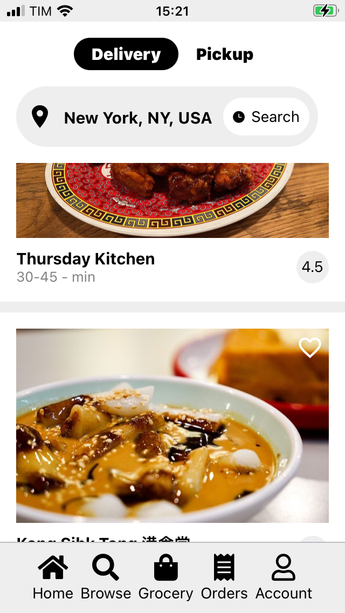
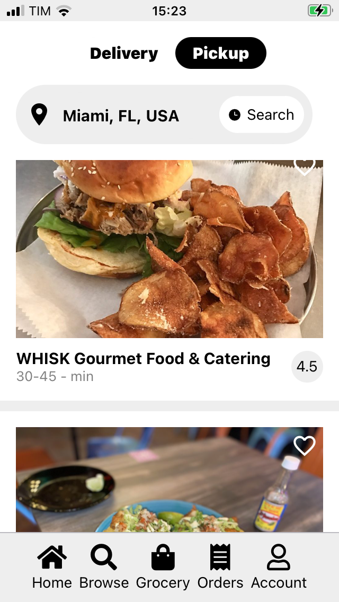
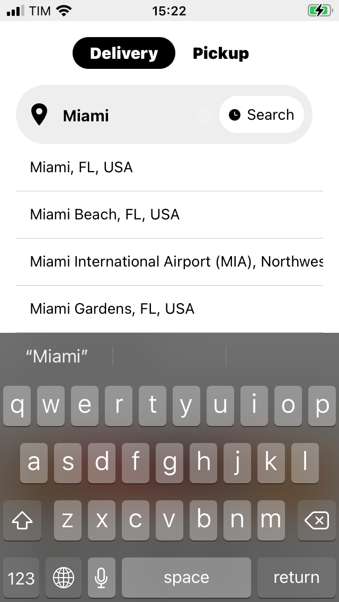

# Uber Eats clone

  <!-- iOS -->
  
  <!-- Android -->
  
  <!-- Web -->
  

This is a clone of the main functionalities of The Uber Eats app using React Native. The aim of this project is only for studying purposes.

Still under development.

By Leandro Roberto based on material of the Clever programmer youtube channel (https://youtu.be/jmvbhuJXFow).

## 🚀 How to use

- Install packages with `yarn` or `npm install`.
- Run `yarn start` to start the bundler.
- Open the project in a React runtime to try it:
  - iOS: [Client iOS](https://itunes.apple.com/app/apple-store/id982107779)
  - Android: [Client Android](https://play.google.com/store/apps/details?id=host.exp.exponent&referrer=blankexample)
  - Web: Any web browser

## Screenshots

### Home Screen

